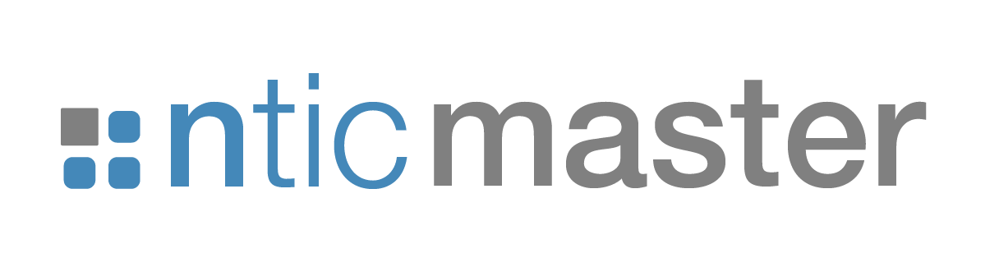

# Máster UCM - TFM Grupo 4 - Año 2025

Este repositorio contiene el código fuente para el Trabajo de Fin de Máster (TFM) del Grupo 4 - Año 2025.

El mismo se trata de la **implementación de un sistema NL2SQL enfoque RAG Multiagente**.

A continuación, puede **acceder a la [Memoria](https://github.com/grimbano/ucm-tfm-grupo-4/blob/0c85b26ba1de01b6b7a53ef7acca844ad8a78f6a/docs/TFM%20-Grupo%204%20-%202025%20-%20Implementaci%C3%B3n%20de%20un%20%20sistema%20NL2SQL%20con%20%20enfoque%20RAG%20Multiagente.pdf)** del mismo.

---

<div align="center">
    
    
    
</div>

https://github.com/user-attachments/assets/0b6418ba-3754-41fc-8b07-52ed83f0ba70

---

## Requisitos previos

* Antes de instalar el repositorio, se recomienda tener instalado `Git Large File Storage (LFS)`. Dado que trabajaremos con Chroma DB, y que esta base de datos vectorial puede persisitir fichero `*.bin` de más de 100MB (tamaño soportado por git sin requerir LFS). Para instalar esta extensión, simplemente alcanza con ejecutar el siguiente comando

    ```bash
    git lfs install
    ```

    En caso de requerir más información sobre esta extensión, puede hacerlo consultando [el siguiente enlace](https://git-lfs.com/).

---

## Inicialización del Repositorio

Para comenzar a trabajar con el proyecto, clona el repositorio a tu máquina local con el siguiente comando:

```bash
git clone https://github.com/grimbano/ucm-tfm-grupo-4.git
cd ucm-tfm-grupo-4
```

## Configuración del Entorno y Variables de Acceso 🔑

El proyecto requiere la configuración de variables de entorno para las credenciales de los servicios de IA y las bases de datos. Debes crear dos archivos `.env` a partir de las plantillas provistas.

### 1. Archivos de configuración (`.env`)

Crea copias de las plantillas con los siguientes comandos:

```bash
cp .env.example .env
cp .env.docker.gradio.example .env.docker.gradio
```

### 2. Credenciales y Acceso

Es **IMPRESCINDIBLE** que completes las variables en ambos archivos (.env y .env.docker.gradio) con la información necesaria.

* **Google Cloud Vertex AI:**
  * Debes tener un archivo Google Application Credentials JSON que facilite el acceso a Vertex AI. Coloca este archivo dentro de la carpeta oculta .secrets/ en la raíz del proyecto.
  * En ambos archivos .env, asegúrate de que la variable GOOGLE_APPLICATION_CREDENTIALS contenga la ruta y el nombre exactos de tu archivo JSON.

* **Azure AI Foundry:**
  * Necesitas las claves de acceso de Azure AI Foundry para interactuar con los servicios de Azure OpenAI.
  * Estas claves deben ser especificadas en ambos archivos .env en las variables correspondientes.

## Modo de Ejecución 🚀

El proyecto está diseñado para ser ejecutado a través de **Docker** para asegurar un entorno de ejecución consistente. No obstante, se detallan los pasos para un entorno de desarrollo local.

### Docker (Modo de ejecución recomendado)

Esta es la forma principal y preferida para probar la herramienta. La ejecución en Docker usa los archivos `docker-compose.yml` y `.env.docker.gradio`.

### Diferencia clave entre `.env` y `.env.docker.gradio`

* El archivo `.env` se utiliza para **desarrollo local** y para montar los servicios de las bases de datos (**Postgres** y **Chroma**).
* El archivo `.env.docker.gradio` se utiliza exclusivamente para el **servicio de Docker de la aplicación de Gradio**. Este archivo usa los nombres de los servicios (ej. `tfm-postgres-db` en lugar de `localhost`) para que la aplicación de Gradio pueda comunicarse con los otros contenedores.

### Parámetros de Gradio

Los parámetros de la aplicación de Gradio ya están configurados en ambos archivos de ejemplo para **evitar conflictos de puertos**, permitiendo que la aplicación se ejecute simultáneamente en modo local y en Docker si lo deseas.

**Aclaración importante:** Cuando se trabaja con la versión contenerizada de la base de datos, es crucial que la variable de entorno `DB_PORT` del archivo `.env` se establezca en `5433`. Esto se debe a que el contenedor de Docker mapea el puerto interno de PostgreSQL (`5432`) a un puerto diferente en tu máquina host para evitar conflictos con posibles instalaciones locales de PostgreSQL.

### Permisos de ejecución para el script

El script `entrypoint.sh` debe tener los permisos de ejecución correctos para que Docker pueda ejecutarlo. El script se encuentra en la ruta `data/database/postgres/docker/`.

* **Para Linux/macOS:**
  
    ```bash
    dos2unix data/database/postgres/docker/entrypoint.sh
    chmod +x data/database/postgres/docker/entrypoint.sh
    ```

* Para Windows:
  
    ```bash
    dos2unix data/database/postgres/docker/entrypoint.sh
    ```

(El comando `chmod` no es necesario en Windows, ya que su sistema de permisos de archivos es diferente).

### Comandos de Docker

1. **Levantar los servicios:**
    Utiliza el archivo `docker-compose.yml` para levantar los servicios de **PostgreSQL**, **ChromaDB** y la **aplicación de Gradio** en segundo plano.

    ```bash
    docker compose down -v
    docker compose up -d --build
    ```

    El comando `docker compose down -v` detiene y elimina cualquier instancia anterior y sus volúmenes, mientras que `docker compose up -d --build` construye y levanta los servicios definidos en el docker-compose.yml.

2. **Ver el estado de los servicios:**
    Para verificar que los servicios se están ejecutando, puedes revisar sus logs:

    ```bash
    docker compose logs tfm-postgres-db
    docker compose logs tfm-chroma-db
    docker compose logs tfm-gradio-app
    ```

## Desarrollo Local (Alternativa)

Para realizar pruebas o trabajar en el código sin usar Docker para la aplicación principal, sigue estos pasos para inicializar el entorno.

1. Actualizar `pip`
    Es una buena práctica asegurarse de que `pip` esté actualizado:

    ```bash
    pip install --upgrade pip
    ```

2. Instalar `uv`
    Este proyecto utiliza `uv` para la gestión de dependencias, que es una herramienta moderna y rápida. Instálalo globalmente:

    ```bash
    pip install uv
    ```

3. Crear el Entorno Virtual
    `uv` creará un entorno virtual y lo activará automáticamente en la ubicación por defecto (`.venv`):

    ```bash
    uv venv
    ```

    Si deseas especificar una ruta diferente para tu entorno virtual, puedes hacerlo con:

    ```bash
    uv venv /ruta/a/tu/entorno
    ```

4. Sincronizar Dependencias
    Con el entorno virtual activado, sincroniza todas las dependencias del proyecto especificadas en `pyproject.toml` y `uv.lock`:

    ```bash
    uv sync
    ```

    Este comando asegurará que todas las bibliotecas necesarias estén instaladas en tu entorno virtual.

5. Pasos Adicionales

    **쮺uándo usar `uv add` y `uv lock`?**

    * `uv add <paquete>`: Utiliza este comando cuando necesites añadir una nueva dependencia a tu proyecto. `uv` no solo instalará el paquete, sino que también lo añadirá automáticamente a `pyproject.toml` y actualizará el archivo `uv.lock`.

        ```bash
        uv add requests
        ```

    * `uv lock`: Debes ejecutar uv lock cuando:

      * Has modificado manualmente pyproject.toml (por ejemplo, has cambiado la versión de una dependencia o añadido una nueva sin usar uv add).
      * Necesitas regenerar el archivo uv.lock para reflejar los cambios en pyproject.toml o para obtener las últimas versiones compatibles de tus dependencias.

        ```bash
        uv lock
        ```

        `uv lock` garantiza que `uv.lock` sea una representación precisa y reproducible de las dependencias de tu proyecto. Después de ejecutar `uv lock`, asegúrate de confirmar los cambios en `uv.lock` en Git, ya que es crucial para la reproducibilidad del entorno entre desarrolladores.
